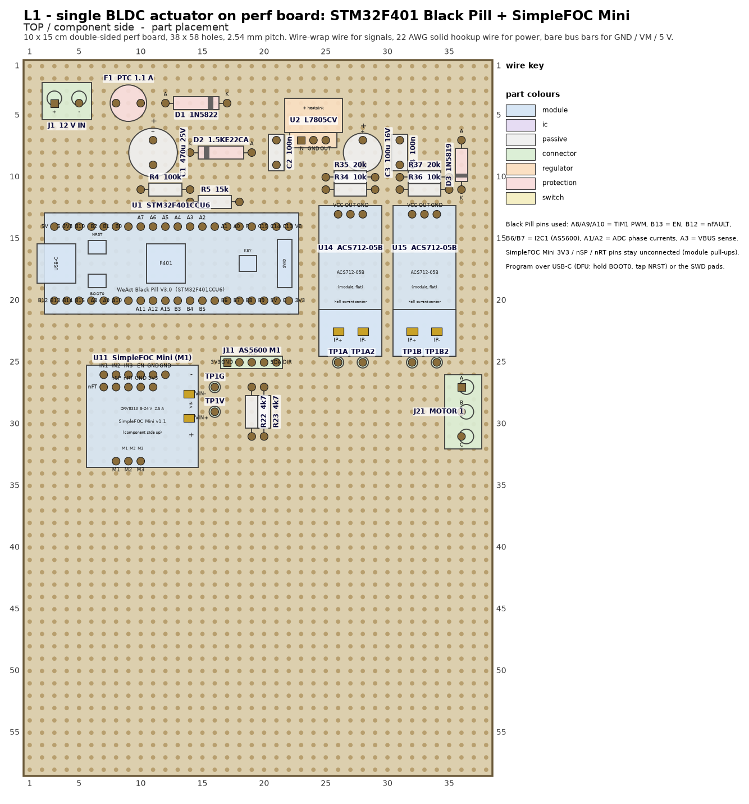
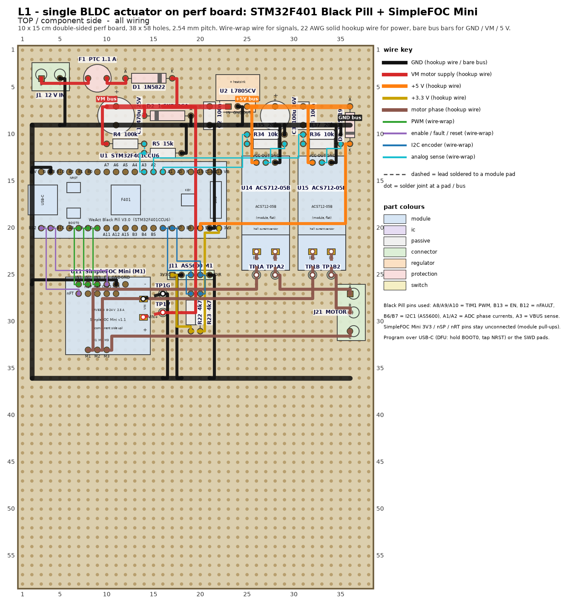
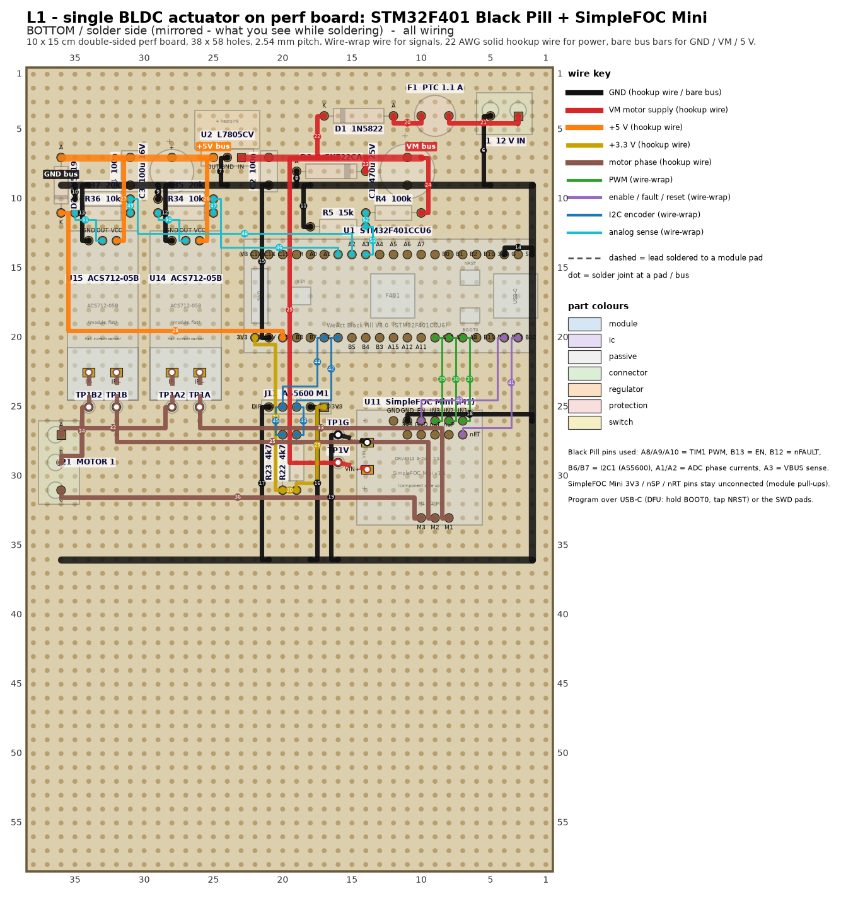
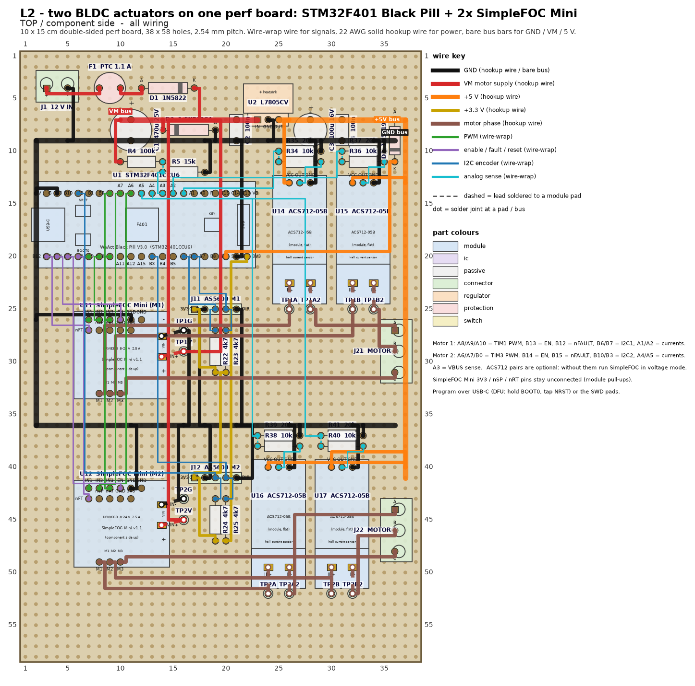
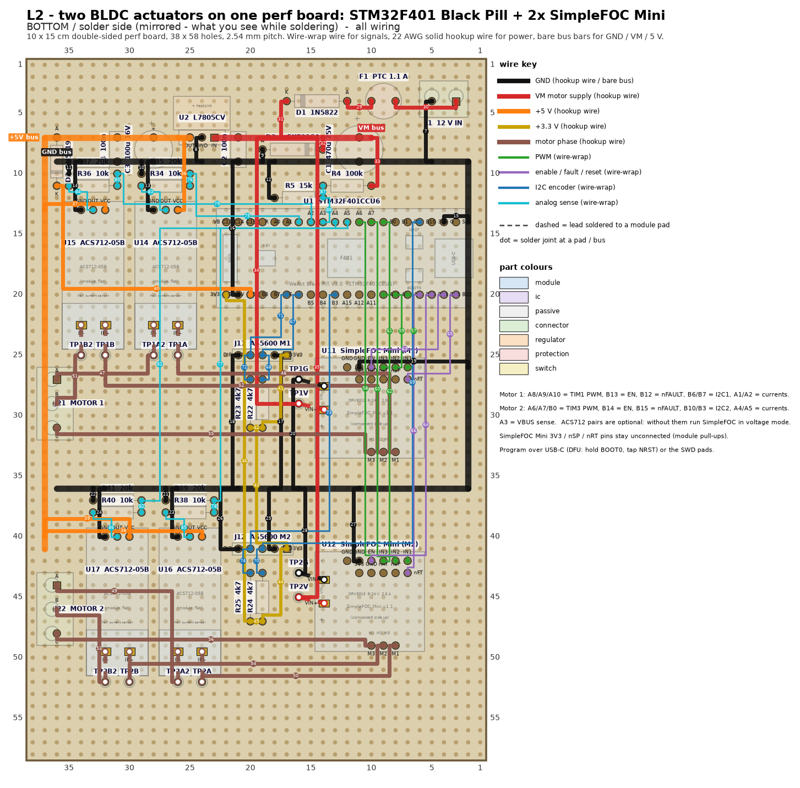
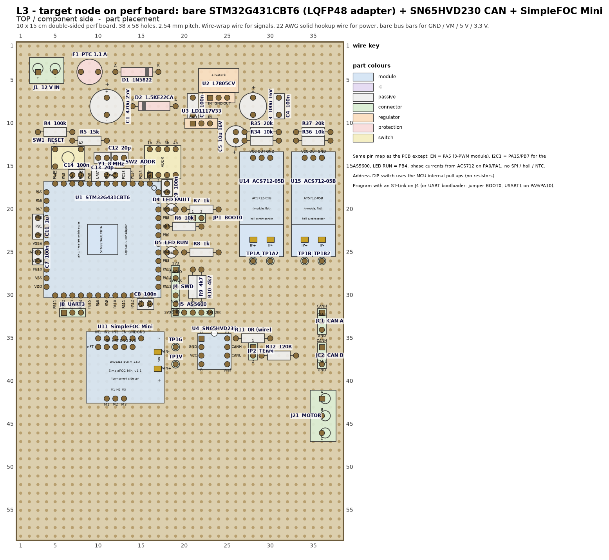
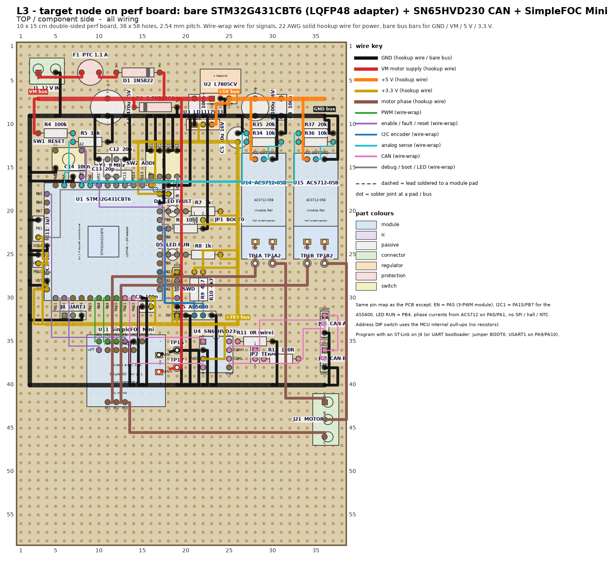
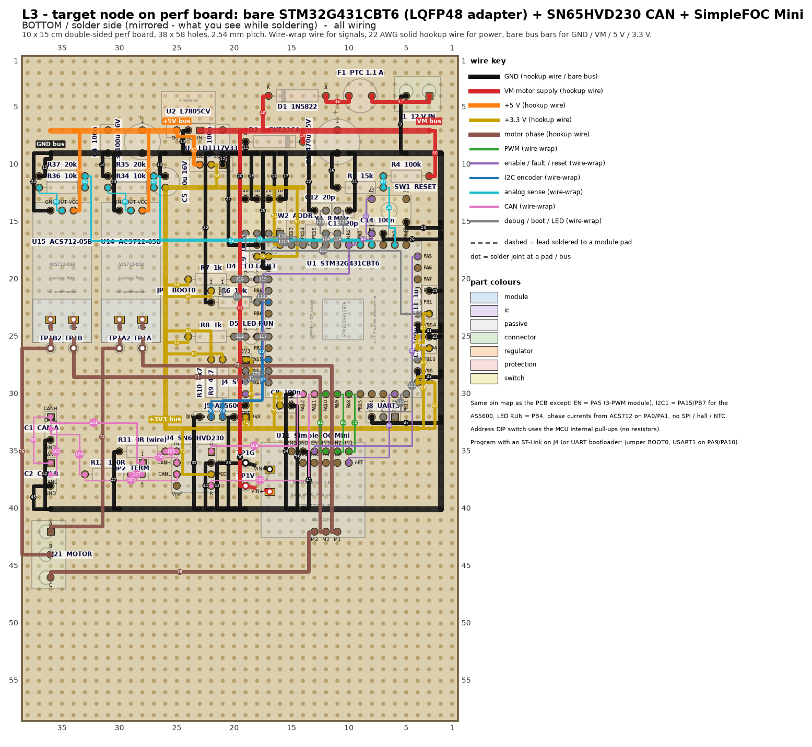

# Perf-board prototypes of the actuator node

Before the PCB in the parent directory is ordered, the node gets built on perf
board with modules, so the motor, the encoder, the current sensing, the pin
map and the firmware can be proven with a soldering iron and nothing else.
This directory holds the plan, three complete layouts (placement pictures,
wiring pictures, numbered wiring lists, BOMs, 1:1 drilling templates) and the
generator that produced them.

| Layout | What it proves | MCU | Driver | Feedback | CAN | Wires |
|---|---|---|---|---|---|---|
| [`L1-single-f401/`](L1-single-f401) | one motor, encoder, current sensing, SimpleFOC on STM32 | WeAct Black Pill (STM32F401CCU6) | SimpleFOC Mini (DRV8313) | AS5600 over I2C1, 2x ACS712 | none (dropped for now) | 59 |
| [`L2-dual-f401/`](L2-dual-f401) | two motors on one MCU (you have parts for two drivers and one MCU) | Black Pill | 2x SimpleFOC Mini | 2x AS5600 (I2C1 + I2C2), up to 4x ACS712 | none | 100 |
| [`L3-g431-can/`](L3-g431-can) | the real target: bare STM32G431CBT6, FDCAN + SN65HVD230, address switch, same pin map as the PCB | STM32G431CBT6 on a LQFP48-to-DIP adapter | SimpleFOC Mini | AS5600, 2x ACS712 | SN65HVD230 on a SOIC-8 adapter | 132 |

All three use the **10 x 15 cm double-sided board (38 x 58 holes)**. The
7 x 9 cm single-sided board does not fit a Black Pill, a driver module, two
current-sensor modules and a power section with tidy wiring; keep it for a
later breakout. Read the recommendation at the [end](#recommendation).

## How the pictures are meant to be used

Every layout directory contains the same set of files:

| File | Use |
|---|---|
| `*-1-placement.png` | where every part goes, seen from the component side; hole coordinates `(column, row)` are printed on the board edge, column 1 / row 1 is the top-left hole |
| `*-2-power.png` | bus bars (bare tinned wire), power hookup wires and motor phase wires, with step numbers |
| `*-3-signals.png` | the wire-wrap wires only, with step numbers |
| `*-4-all-top.png` | everything, component-side view |
| `*-5-bottom-mirrored.png` | everything, **mirrored** as you see it while soldering (parts ghosted) |
| `*-template-1to1.pdf` | print at 100 %: lay it on the board to mark the holes with a pen |
| `*-wiring.csv` | one row per wire in build order: step, net, class, from `ref.pin (col,row)`, to, wire type, cut length |
| `*-parts.csv` | every part with the hole coordinates of each pin |
| `*-bom.csv` | parts to gather, with notes |

Wiring conventions the pictures follow:

* **Bus bars**: GND, VM (motor supply), +5 V (and +3.3 V on L3) are bare
  tinned 22 AWG solid wire laid along a row or column of holes on the solder
  side. Leads that sit on the bus line are soldered straight to it; anything
  else reaches the bus with a short hookup-wire *tap*.
* **Power** (red VM, orange 5 V, yellow 3.3 V, black GND, brown motor
  phases): 22 AWG single-core hookup wire.
* **Signals** (green PWM, violet enable/fault, blue I2C, cyan analog, pink
  CAN, grey debug): 30 AWG wire-wrap wire, soldered.
* Every wire is a Manhattan path: it leaves the pad by half a hole into the
  channel between holes, runs along that channel, turns into the channel next
  to the destination row and enters the destination pad. Wires that would
  share a channel are stepped into neighbouring channels (a staircase) so
  bundles stay readable and no wire runs across a used pad. Dotted short
  links between neighbouring holes are just the two leads bent together.
* **Solder points** `TPxx` are free holes where a hookup wire comes up to the
  component side to reach a screw terminal on a module (the SimpleFOC Mini's
  VIN terminal, the ACS712 current terminals). Those top-side leads are drawn
  dashed.
* The wiring list is ordered so the board is built in layers: bus bars, GND
  taps, VM, 5 V, 3.3 V, phases, PWM, control, I2C, analog, CAN, debug.

## Common power section (rows 3-12 on all three layouts)

```
12 V in (J1) -> F1 PTC 1.1 A -> D1 1N5822 (reverse polarity) -> VM bus (row 7)
                                                     |-- C1 470 uF, D2 1.5KE22CA TVS
                                                     |-- U2 L7805CV + heatsink -> +5 V bus (row 7, right half)
                                                             |-- ACS712 modules (5 V parts)
                                                             |-- D3 1N5819 -> Black Pill 5V pin   (L1, L2)
                                                             |-- U3 LD1117V33 -> +3.3 V bus      (L3)
GND bus: row 9 across the board, down column 2, and back across row 36 (L1/L2) or row 40 (L3)
VBUS sense: 100k / 15k divider from VM -> PA3 (12 V -> 1.57 V, 24 V max)
```

The PCB uses a P-channel FET for reverse polarity; on the prototype a 3 A
Schottky in series is one part instead of three and costs 0.5 V at 1 A, which
a 2804 gimbal motor never notices. The TVS is optional on a bench supply.
The 7805 dissipates about 0.7 W at 12 V (two ACS712 + Black Pill + encoder),
so it gets a small clip-on heatsink.

## L1 - single motor, Black Pill





Pin map (Black Pill labels):

| Black Pill pin | Function | Goes to |
|---|---|---|
| A8 / A9 / A10 | TIM1 CH1-3 PWM | SimpleFOC Mini IN1 / IN2 / IN3 |
| B13 | driver enable | SimpleFOC Mini EN |
| B12 | driver fault (open drain, module pull-up) | SimpleFOC Mini nFT |
| B6 / B7 | I2C1 SCL / SDA (4k7 pull-ups on the board) | J11 AS5600 header |
| A1 / A2 | ADC phase currents A / B | ACS712 outputs through 10k / 20k dividers |
| A3 | ADC VBUS | 100k / 15k divider from VM |
| 5V (bottom row) | board supply | +5 V bus through D3 |
| G (both) / 3V3 (bottom) | ground / 3.3 V for encoder and pull-ups | buses |

Notes:

* The **SimpleFOC Mini is mounted component side up** with male pin strips
  soldered downwards (1x6 + 1x5 control, 1x3 motor), plugged into female
  sockets on the perf board or soldered straight in. The module's 3V3 pin is
  the DRV8313's own regulator output and stays unconnected; nSP and nRT are
  pulled up on the module and stay unconnected; EN has a module pull-down.
  If your module was delivered with *female* headers already soldered, it
  has to plug in upside-down: use the mirrored pin order in the table at the
  end and regenerate the pictures with `fp_sfmini(..., flip=True)`.
* VM and GND for the module go into its screw terminal from the two solder
  points next to it (TP1V, TP1G).
* Phase A and B run from the module's M1 / M2 pins through the two ACS712
  modules (hookup wire up through TP1A into IP+, back down from IP- through
  TP1A2) to the motor terminal; phase C goes straight to the terminal.
  The ACS712 pair is optional: without them run SimpleFOC in voltage mode,
  which is the normal mode for a 2804 gimbal motor anyway.
* ACS712-05B: 185 mV/A, output centred on 2.5 V. After the 20k / (10k + 20k)
  divider that is 123 mV/A centred on 1.67 V, safe for the 3.3 V ADC. In
  SimpleFOC: `InlineCurrentSense(0.01f, 12.33f, PA1, PA2)` (0.01 ohm x 12.33
  = 0.1233 V/A); the zero offset is calibrated at `init()`.
* Programming: USB-C DFU (hold BOOT0, tap NRST, `dfu-util` or STM32CubeProg)
  or the SWD pads on the right end of the Black Pill. Arduino / PlatformIO
  with the stm32duino core (`BLACKPILL_F401CC`) and the SimpleFOC library.

## L2 - two motors, Black Pill




L2 is L1 plus a second driver block in the lower half of the board; the
motor-1 wiring is identical to L1.

| Black Pill pin | Function (motor 2) | Goes to |
|---|---|---|
| A6 / A7 / B0 | TIM3 CH1-3 PWM | SimpleFOC Mini 2 IN1 / IN2 / IN3 |
| B14 / B15 | enable / fault | SimpleFOC Mini 2 EN / nFT |
| B10 / B3 | I2C2 SCL / SDA (PB3 is I2C2_SDA on AF9) | J12 AS5600 header |
| A4 / A5 | ADC phase currents | ACS712 3 / 4 through dividers |

* Two AS5600s share the fixed address 0x36, hence two I2C buses.
  In stm32duino open the second bus as `TwoWire Wire2(PB3, PB10)` (SDA, SCL)
  and give the second `MagneticSensorI2C` that bus.
* The +5 V bus continues down column 37 to feed the lower ACS712 pair; the VM
  feed for the second module is one long red wire from the VM bus down
  column 16 (route it along the left edge if you prefer).
* With only two ACS712 modules on hand, fit them on motor 1 and run motor 2
  in voltage mode, or fit one per motor and use SimpleFOC's single-phase
  option only for monitoring.

## L3 - bare STM32G431CBT6 + SN65HVD230 (the target)





The LQFP-48 sits on a 0.5 mm-pitch QFP48-to-DIP adapter (33 mm square, 12
pins per side, opposite pin rows 13 holes apart; if yours differs change
`pitch_rows` in `fp_qfp48_adapter`). The adapter is rotated so that the ADC
pins face the current sensors, the PWM and CAN pins face the driver and the
transceiver, and SWD / I2C / boot / LED pins face the right-hand cluster.
Pin names, not numbers, are printed on the pictures; `L3-parts.csv` has both.

| G431 pin | Function | Prototype connection | vs. the PCB |
|---|---|---|---|
| PA8 / PA9 / PA10 | TIM1 CH1-3 | SimpleFOC Mini IN1-3 | same (the low-side pins PB13-15 are unused with a 3-PWM module) |
| PA5 | driver enable | SimpleFOC Mini EN | new (was SPI SCK) |
| PB12 | driver fault | SimpleFOC Mini nFT | same |
| PA0 / PA1 | ADC1 phase currents | ACS712 dividers | same pins, different sensor |
| PA3 | VBUS sense | 100k / 15k divider | same |
| PA15 / PB7 | I2C1 SCL / SDA | AS5600 header J5 | new: the motor carries an AS5600, the PCB needs I2C on its feedback connector |
| PA11 / PA12 | FDCAN1 RX / TX | SN65HVD230 R / D | same |
| PC13 / PC14 / PC15 / PB2 | node address | 4-way DIP switch to GND, MCU internal pull-ups | same pins, no resistors |
| PB9 / PB4 | LED FAULT / LED RUN | active-low LEDs from 3.3 V | LED RUN moved from PB7 (now SDA) |
| PA13 / PA14 | SWD | J4 (3V3, SWDIO, SWCLK, NRST, GND) | same |
| PB10 / PB11 | USART3 TX / RX | J8 | same |
| PB8 | BOOT0 | 10k pull-down + jumper to 3.3 V | same |
| PF0 / PF1 | 8 MHz crystal + 2x 20 pF | Y1, C12, C13 | same |
| NRST | 100 nF + reset button + J4 | C14, SW1 | same |

* Supplies: 7805 -> LD1117V33 -> a U-shaped bare +3.3 V bus around the
  adapter (row 12, column 26, row 33). Each VDD/VSS pair has a 100 nF right
  at the pins; VDDA / VREF+ get a 1 uF; the LD1117 gets a 10 uF output
  capacitor. Use a tantalum or an electrolytic there, not a low-ESR polymer -
  the LD1117 wants a little ESR to stay stable (or use an AMS1117-3.3 module).
* CAN: SN65HVD230 on a SOIC-8-to-DIP adapter, Rs to GND through R11 (0 R =
  high-speed; 10k for slope control below 500 kbit/s), 120 R termination
  behind jumper JP2, two 1x3 headers (CANH, CANL, GND) for daisy-chaining.
  The 8 MHz crystal is there for FDCAN bit timing; do not run CAN from HSI.
* Programming: ST-Link V2 on J4 (SWD). Fallback without a probe: fit the
  BOOT0 jumper, reset, and use the ROM bootloader on USART1 (PA9 / PA10 -
  they are PWM pins, but the driver is disabled by its EN pull-down while the
  MCU is in the bootloader).

## Build order

1. Print the 1:1 template, tape it on the board and mark the sockets.
2. Solder the female sockets (2x 1x20 for the Black Pill, 1x6 + 1x5 + 1x3 per
   SimpleFOC Mini, 1x3 per ACS712, the adapter's 4x 1x12 on L3), screw
   terminals and pin headers first - they set the geometry.
3. Lay the bare bus bars (steps 1-n in the wiring list), then the passives
   whose leads sit on the buses.
4. Power section only: apply 12 V, check VM, +5 V (and +3.3 V on L3) before
   any module is plugged in.
5. GND taps, then VM, 5 V, 3.3 V, then the phase hookup wires.
6. Signal wires in list order, class by class, ticking off step numbers on
   the `*-3-signals.png` print.
7. Plug in the modules and bring up in this order: MCU alone (USB / SWD
   connect, blink), AS5600 angle readout, driver open-loop velocity, sensor
   alignment, closed-loop velocity / position, then current-sense
   calibration, then (L3) CAN loopback and a two-node bus.

## Parts

Everything is through-hole or a module. You already have the resistors,
ceramic and polymer capacitors, ACS712 modules, SimpleFOC Minis, the
STM32G431CBT6 and the SN65HVD230DR. To buy: WeAct Black Pill V3.0 (L1/L2),
QFP48-to-DIP adapter + SOIC8-to-DIP adapter (L3), L7805CV + heatsink,
LD1117V33 (L3), 1N5822, 1N5819, 1.5KE22CA (optional), a 1.1 A PTC, 470 uF /
25 V, 100 uF, 10 uF (L3), 8 MHz crystal (L3), 4-way DIP switch, a 6 mm
tactile switch, two LEDs (L3), 5.08 mm screw terminals (2- and 3-position),
female socket strips and male pin strips, 22 AWG solid hookup wire in red /
black / orange / yellow / brown, 30 AWG wire-wrap wire, bare tinned wire.
`*-bom.csv` in each directory is the exact list.

## SimpleFOC Mini pin order, both mountings

Component side up (male pins down, used in the pictures), seen from above:

```
upper row  L->R : IN1  IN2  IN3  EN   GND  GND
lower row  L->R : nFT  nSP  nRT  GND  3V3          (under the left five)
motor      L->R : M1   M2   M3                     (7 holes below the upper row)
VIN screw terminal on the right edge (- above +)
```

Upside-down (module delivered with female headers), seen from above:

```
upper row  L->R : GND  GND  EN   IN3  IN2  IN1
lower row  L->R : 3V3  GND  nRT  nSP  nFT          (under the right five)
motor      L->R : M3   M2   M1
VIN screw terminal on the left edge
```

v1.0 modules have a different upper row (EN IN3 IN2 IN1 GND, five pins) and
a motor header about 1 mm off the grid; `fp_sfmini(version="v1.0")`.

## What flows back into the PCB design

* The motor carries an AS5600: the PCB's feedback connector needs I2C (SCL
  PA15, SDA PB7, 3.3 V, GND) - the Hall / quadrature inputs alone do not
  serve this motor. LED RUN moves off PB7.
* A 3-PWM driver needs an enable pin (PA5 on the prototype); the DRV8311S on
  the PCB is controlled over SPI instead, so this stays prototype-only.
* The node address switch works on the MCU's internal pull-ups; the four
  10k pull-ups on the PCB can go.
* VBUS divider: 100k / 15k keeps a 24 V supply inside the ADC range.

## Regenerating the pictures

```sh
pip install matplotlib
python3 tools/layouts.py            # writes L1-*/ L2-*/ L3-*/ next to this README
python3 tools/layouts.py out L3     # only one layout, into ./out
```

`tools/perfboard.py` is the layout engine: a 2.54 mm hole grid, footprints
(pins as hole offsets, module pads may be off-grid), parts placed with a
hole coordinate and a rotation, nets declared as pin lists (point-to-point,
or tapped onto a bare bus polyline), Manhattan routing in the channels
between holes with lane assignment, and a checker that fails the run if two
pins share a hole, two bodies overlap, a bus runs through a foreign pin, a
tap lands on a foreign pin, a net is not fully connected by the drawn
wires, or two nets are joined. `tools/layouts.py` is the readable
description of the three boards - move a part by changing its hole
coordinate and rerun.

## Recommendation

1. **Build L1 first.** It has the fewest wires (59), every expensive part is
   on a socket, and it answers the questions that matter before a PCB:
   does the 2804 + AS5600 combination run closed-loop FOC on an STM32 with
   this pin map, and is ACS712 current sensing good enough or should the PCB
   keep the driver's own sense amplifiers (it should - keep the DRV8311S
   sense path on the PCB, the ACS712s are a prototype convenience).
2. **Skip L2 unless the mechanism test needs two joints moving from one
   controller.** It is L1 plus the lower half of the board and costs another
   40 wires and two long feeds; the one thing it proves that L1 does not is
   running two SimpleFOC instances on one F401 (TIM1 + TIM3, two I2C
   buses), which the target node never does - the target is one node per
   actuator.
3. **Build L3 as soon as L1 runs**, reusing the driver, sensor and power
   blocks. It is the only layout that exercises the actual target: the bare
   G431, FDCAN through the SN65HVD230, the address switch and the PCB's pin
   assignment. Solder the LQFP-48 onto its adapter first and get an SWD
   connection and a blinking LED before wiring anything else - that is the
   one step on this board that needs a steady hand, everything after it is
   0.1 in pitch. Two L3 boards on one bus, with the termination jumper fitted
   on both, is the test that clears the PCB for ordering.
4. Keep the 7 x 9 cm single-sided board for a separate CAN breakout or a
   sense strip; none of the three layouts fits on it without giving up the
   tidy wiring you asked for.
